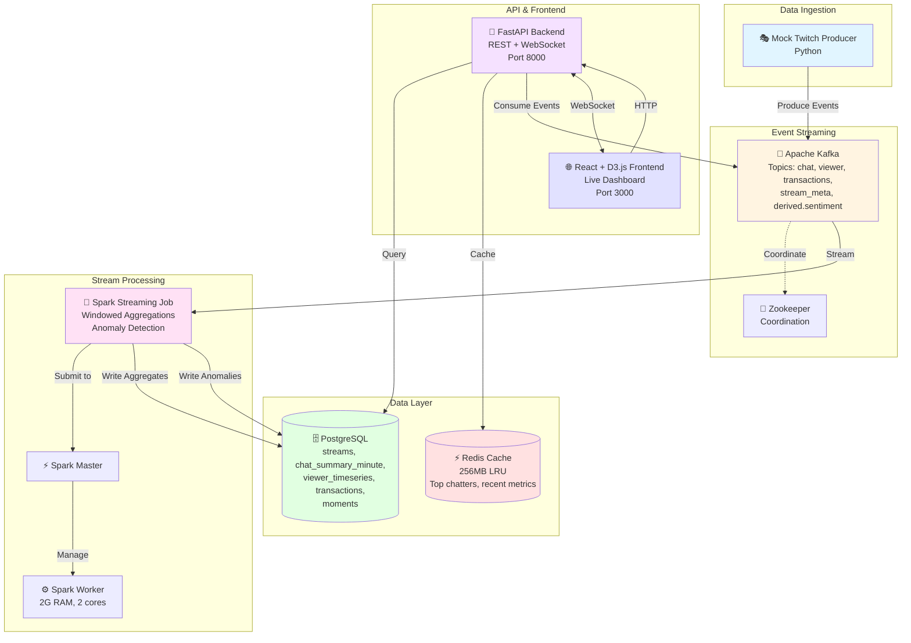

<div align="center">

# 📊 Telemetra

### Real-time Twitch Analytics Platform

*Powered by streaming architecture for instant insights*

[](https://kafka.apache.org/)
[](https://spark.apache.org/)
[](https://www.postgresql.org/)
[](https://redis.io/)
[](https://fastapi.tiangolo.com/)
[](https://reactjs.org/)
[](https://d3js.org/)
[](https://www.docker.com/)
[](https://www.typescriptlang.org/)
[](https://www.python.org/)

[Features](#-features) • [Quick Start](#-quick-start) • [Architecture](#-architecture) • [Documentation](#-documentation)

</div>

---

## 🚀 Quick Start

Get the system running in **3 commands**:

```bash
# 1️⃣ Copy environment configuration
cp .env.example .env

# 2️⃣ Start all services with Docker Compose
docker compose up --build

# 3️⃣ Access the dashboard
# 🌐 Frontend: http://localhost:3000
# 🔧 Backend API: http://localhost:8000/docs
# ⚡ Spark Master UI: http://localhost:8080
```

<details>
<summary><b>What happens automatically? 🤔</b></summary>

- ✅ Initialize Kafka topics
- ✅ Create PostgreSQL database schema
- ✅ Start mock Twitch event producer
- ✅ Begin Spark streaming aggregations
- ✅ Serve real-time dashboard with WebSocket updates

*Startup time: ~2-3 minutes for all services to be ready*

</details>

---

## 📖 Overview

**Telemetra** is a production-grade real-time analytics platform that processes live Twitch events, detects anomalies, and provides interactive visualizations. Built to demonstrate enterprise streaming architecture patterns.

### 🎯 Use Cases

- 📈 **Monitor viewer engagement** in real-time
- 🚨 **Detect unusual activity** - chat spikes, viewer drops
- 💬 **Track top chatters** and trending emotes
- 😊 **Analyze sentiment** and toxicity patterns
- 💰 **Revenue tracking** via transaction monitoring

### 🏗️ Key Components

| Component | Purpose | Technology |
|-----------|---------|------------|
| **Event Streaming** | High-throughput message queue | Apache Kafka + Zookeeper |
| **Stream Processing** | Windowed aggregations & anomaly detection | Spark Structured Streaming |
| **Data Storage** | Persistent metrics & time-series data | PostgreSQL 15 |
| **Caching Layer** | Low-latency hot data access | Redis 7 (LRU eviction) |
| **Backend API** | REST + WebSocket endpoints | FastAPI (async) |
| **Frontend** | Live dashboard with visualizations | React 18 + D3.js + TypeScript |
| **Data Generator** | Mock Twitch events | Python producer |

---

## 🏛️ Architecture



### 🔄 Data Flow

1. **Producer** → Generates mock Twitch events (chat, viewers, transactions, metadata)
2. **Kafka** → Buffers events in topics with 24-hour retention
3. **Spark Streaming** → Consumes events, performs 1-minute windowed aggregations, detects anomalies using z-score analysis
4. **PostgreSQL** → Stores aggregated metrics, detected moments/anomalies, and raw transactions
5. **Redis** → Caches frequently accessed data (top chatters, recent viewer counts)
6. **Backend** → Serves REST API endpoints and WebSocket connections
7. **Frontend** → Displays interactive D3.js visualizations with live updates

---

## ✨ Features

### ⚡ Real-Time Processing

- **1-minute windowed aggregations** for chat rate, viewer count, transaction volume
- **Watermarking** for late data handling (10-second threshold)
- **Anomaly detection** using z-score (threshold: 3.0) for chat spikes and viewer drops
- **Sentiment analysis** with lexicon-based scoring (ready for ML models)

### 🔌 API Endpoints

| Endpoint | Method | Description |
|----------|--------|-------------|
| `/health` | GET | Service health check |
| `/streams` | GET | List all tracked streams |
| `/streams/{id}/metrics` | GET | Historical metrics for a stream |
| `/streams/{id}/moments` | GET | Detected anomalies and moments |
| `/live/{stream_id}` | WebSocket | Real-time metric updates |

### 📊 Dashboard Visualizations

- **📈 Viewer Chart** - D3.js line chart with historical and live viewer counts
- **💬 Chat Rate Chart** - Real-time chat message rate with anomaly highlights
- **📌 Live Metrics** - Current viewer count, chat rate, transactions per minute
- **🎯 Moments List** - Timeline of detected anomalies with severity indicators

### 🔍 Monitoring & Observability

- ✅ **Health checks** for all Docker Compose services
- 🖥️ **Spark UI** for job monitoring (port 8080)
- 📚 **FastAPI docs** with Swagger UI (port 8000/docs)

---

## 📋 Prerequisites

- **Docker** 24.0+ and **Docker Compose** 2.20+
- **Git** for cloning the repository
- **8GB RAM minimum** (Spark worker uses 2GB, Postgres/Kafka/Redis use additional memory)
- **Ports available**: 2181 (Zookeeper), 9092/29092 (Kafka), 5432 (Postgres), 6379 (Redis), 7077/8080 (Spark), 8000 (Backend), 3000 (Frontend)

---

## 📦 Services

<table>
<tr>
<td width="50%">

### 🔧 Infrastructure

| Service | Image | Port | Purpose |
|---------|-------|------|---------|
| **Zookeeper** | confluentinc/cp-zookeeper:7.5.0 | 2181 | Kafka coordination |
| **Kafka** | confluentinc/cp-kafka:7.5.0 | 9092, 29092 | Event streaming |
| **PostgreSQL** | postgres:15-alpine | 5432 | Data persistence |
| **Redis** | redis:7-alpine | 6379 | Caching layer |

</td>
<td width="50%">

### ⚙️ Processing & Apps

| Service | Technology | Port | Purpose |
|---------|-----------|------|---------|
| **Spark Master** | bitnami/spark:3.5.0 | 7077, 8080 | Job coordination |
| **Spark Worker** | bitnami/spark:3.5.0 | - | Task execution |
| **Streaming Job** | PySpark | - | Aggregations |
| **Backend** | FastAPI | 8000 | REST + WebSocket |
| **Frontend** | React + Vite | 3000 | Dashboard UI |
| **Producer** | Python | - | Mock events |

</td>
</tr>
</table>

<details>
<summary><b>📍 Access URLs</b></summary>

| Service | URL | Description |
|---------|-----|-------------|
| **Frontend Dashboard** | http://localhost:3000 | React app with live visualizations |
| **Backend API Docs** | http://localhost:8000/docs | Interactive Swagger UI |
| **Spark Master UI** | http://localhost:8080 | Spark job monitoring |
| **Kafka** | localhost:29092 | Kafka broker (external access) |
| **PostgreSQL** | localhost:5432 | Database (credentials in .env) |
| **Redis** | localhost:6379 | Cache |

</details>

---

## 📚 Documentation

### 🔧 Runbook

<details>
<summary><b>View Logs</b></summary>

```bash
# All services
docker compose logs -f

# Specific service
docker compose logs -f backend
docker compose logs -f spark-streaming
docker compose logs -f producer

# Last 100 lines
docker compose logs --tail 100 kafka
```

</details>

<details>
<summary><b>Restart Services</b></summary>

```bash
# Restart backend only
docker compose restart backend

# Rebuild and restart frontend
docker compose up --build -d frontend
```

</details>

<details>
<summary><b>Access Service Shells</b></summary>

```bash
# PostgreSQL shell
docker exec -it telemetra-postgres psql -U telemetra_user -d telemetra

# Backend shell
docker exec -it telemetra-backend bash

# Kafka shell
docker exec -it telemetra-kafka bash
```

</details>

<details>
<summary><b>Health Checks</b></summary>

```bash
# All health checks
docker compose ps

# Backend health endpoint
curl http://localhost:8000/health

# Kafka broker status
docker exec telemetra-kafka kafka-broker-api-versions --bootstrap-server localhost:9092

# PostgreSQL connection
docker exec telemetra-postgres pg_isready -U telemetra_user
```

</details>

<details>
<summary><b>Kafka Operations</b></summary>

```bash
# List topics
docker exec telemetra-kafka kafka-topics --list --bootstrap-server localhost:9092

# Describe topic
docker exec telemetra-kafka kafka-topics --describe --topic twitch-events --bootstrap-server localhost:9092

# Consume messages (last 10)
docker exec telemetra-kafka kafka-console-consumer \
  --bootstrap-server localhost:9092 \
  --topic twitch-events \
  --from-beginning \
  --max-messages 10

# Check consumer group lag
docker exec telemetra-kafka kafka-consumer-groups \
  --bootstrap-server localhost:9092 \
  --describe \
  --group spark-streaming-consumer
```

</details>

<details>
<summary><b>Database Operations</b></summary>

```bash
# Connect to PostgreSQL
docker exec -it telemetra-postgres psql -U telemetra_user -d telemetra

# Backup database
docker exec telemetra-postgres pg_dump -U telemetra_user telemetra > backup.sql

# Restore database
cat backup.sql | docker exec -i telemetra-postgres psql -U telemetra_user -d telemetra

# Run migration manually
docker exec -i telemetra-postgres psql -U telemetra_user -d telemetra < backend/migrations/001_init_schema.sql
```

</details>

<details>
<summary><b>Redis Operations</b></summary>

```bash
# Connect to Redis CLI
docker exec -it telemetra-redis redis-cli

# Check cache keys
docker exec telemetra-redis redis-cli KEYS '*'

# Get cached value
docker exec telemetra-redis redis-cli GET top_chatters:stream_1

# Clear cache
docker exec telemetra-redis redis-cli FLUSHALL
```

</details>

### 📊 Sample Analytics Queries

<details>
<summary><b>Top Chatters (Last Hour)</b></summary>

```sql
SELECT
    username,
    COUNT(*) as message_count
FROM chat_summary_minute
WHERE timestamp > NOW() - INTERVAL '1 hour'
GROUP BY username
ORDER BY message_count DESC
LIMIT 10;
```

</details>

<details>
<summary><b>Top Emotes (Last 24 Hours)</b></summary>

```sql
SELECT
    emote,
    COUNT(*) as usage_count
FROM chat_summary_minute
WHERE
    timestamp > NOW() - INTERVAL '24 hours'
    AND emote IS NOT NULL
GROUP BY emote
ORDER BY usage_count DESC
LIMIT 20;
```

</details>

<details>
<summary><b>Viewer Trends (Hourly Average)</b></summary>

```sql
SELECT
    DATE_TRUNC('hour', timestamp) as hour,
    stream_id,
    AVG(viewer_count) as avg_viewers,
    MAX(viewer_count) as peak_viewers,
    MIN(viewer_count) as min_viewers
FROM viewer_timeseries
WHERE timestamp > NOW() - INTERVAL '7 days'
GROUP BY hour, stream_id
ORDER BY hour DESC;
```

</details>

<details>
<summary><b>Detected Anomalies (Recent)</b></summary>

```sql
SELECT
    timestamp,
    stream_id,
    moment_type,
    description,
    severity,
    metadata
FROM moments
WHERE timestamp > NOW() - INTERVAL '24 hours'
ORDER BY timestamp DESC
LIMIT 50;
```

</details>

<details>
<summary><b>Chat Activity by Hour of Day</b></summary>

```sql
SELECT
    EXTRACT(HOUR FROM timestamp) as hour_of_day,
    AVG(message_count) as avg_messages,
    COUNT(*) as sample_count
FROM chat_summary_minute
WHERE timestamp > NOW() - INTERVAL '7 days'
GROUP BY hour_of_day
ORDER BY hour_of_day;
```

</details>

<details>
<summary><b>Revenue by Stream</b></summary>

```sql
SELECT
    stream_id,
    COUNT(*) as transaction_count,
    SUM(amount) as total_revenue,
    AVG(amount) as avg_transaction
FROM transactions
WHERE timestamp > NOW() - INTERVAL '30 days'
GROUP BY stream_id
ORDER BY total_revenue DESC;
```

</details>

<details>
<summary><b>Sentiment Distribution</b></summary>

```sql
SELECT
    stream_id,
    CASE
        WHEN sentiment_score > 0.5 THEN 'Positive'
        WHEN sentiment_score < -0.5 THEN 'Negative'
        ELSE 'Neutral'
    END as sentiment_category,
    COUNT(*) as count
FROM chat_summary_minute
WHERE
    timestamp > NOW() - INTERVAL '24 hours'
    AND sentiment_score IS NOT NULL
GROUP BY stream_id, sentiment_category
ORDER BY stream_id, sentiment_category;
```

</details>

---

## 🐛 Troubleshooting

<details>
<summary><b>Services Won't Start</b></summary>

**Symptom**: `docker compose up` fails or services restart repeatedly

**Solutions**:
1. Check port availability:
   ```bash
   netstat -an | grep -E '(3000|8000|5432|6379|9092|2181|7077|8080)'
   ```
2. Check Docker resources (need 8GB+ RAM):
   ```bash
   docker system info | grep -E '(Memory|CPUs)'
   ```
3. Review logs for specific service:
   ```bash
   docker compose logs kafka
   docker compose logs postgres
   ```

</details>

<details>
<summary><b>Kafka Connection Errors</b></summary>

**Symptom**: Producer or Spark job can't connect to Kafka

**Solutions**:
1. Wait for Kafka health check to pass:
   ```bash
   docker compose ps kafka
   ```
2. Verify Kafka is listening:
   ```bash
   docker exec telemetra-kafka kafka-broker-api-versions --bootstrap-server localhost:9092
   ```
3. Restart Kafka and dependent services:
   ```bash
   docker compose restart zookeeper kafka
   docker compose restart spark-streaming producer
   ```

</details>

<details>
<summary><b>Database Connection Errors</b></summary>

**Symptom**: Backend can't connect to PostgreSQL

**Solutions**:
1. Verify PostgreSQL is ready:
   ```bash
   docker exec telemetra-postgres pg_isready -U telemetra_user
   ```
2. Check database exists:
   ```bash
   docker exec telemetra-postgres psql -U telemetra_user -l
   ```
3. Verify credentials in .env match docker-compose.yml

</details>

<details>
<summary><b>Spark Job Not Processing</b></summary>

**Symptom**: No data appearing in PostgreSQL

**Solutions**:
1. Check Spark Master UI: http://localhost:8080
2. Review Spark streaming logs:
   ```bash
   docker compose logs spark-streaming --tail 200
   ```
3. Verify Kafka topics have data:
   ```bash
   docker exec telemetra-kafka kafka-console-consumer \
     --bootstrap-server localhost:9092 \
     --topic twitch-events \
     --from-beginning \
     --max-messages 5
   ```

</details>

<details>
<summary><b>WebSocket Connection Fails</b></summary>

**Symptom**: Frontend shows "Disconnected"

**Solutions**:
1. Verify backend is healthy:
   ```bash
   curl http://localhost:8000/health
   ```
2. Check backend logs:
   ```bash
   docker compose logs backend | grep -i websocket
   ```
3. Test WebSocket manually:
   ```bash
   wscat -c ws://localhost:8000/live/stream_1
   ```

</details>

<details>
<summary><b>No Data in Dashboard</b></summary>

**Symptom**: Frontend loads but shows empty charts

**Solutions**:
1. Verify producer is running:
   ```bash
   docker compose logs producer --tail 50
   ```
2. Check data exists in PostgreSQL:
   ```bash
   docker exec -it telemetra-postgres psql -U telemetra_user -d telemetra \
     -c "SELECT COUNT(*) FROM viewer_timeseries;"
   ```
3. Verify backend API returns data:
   ```bash
   curl http://localhost:8000/streams
   ```

</details>

<details>
<summary><b>High Memory Usage</b></summary>

**Symptom**: System runs out of memory

**Solutions**:
1. Reduce Spark worker memory in docker-compose.yml:
   ```yaml
   SPARK_WORKER_MEMORY=1G  # Down from 2G
   ```
2. Reduce Redis max memory:
   ```yaml
   command: redis-server --maxmemory 128mb --maxmemory-policy allkeys-lru
   ```
3. Limit Kafka log retention:
   ```yaml
   KAFKA_LOG_RETENTION_HOURS: 12  # Down from 24
   ```

</details>

---

## 🚧 Roadmap

### 🎯 Short-term Enhancements
- [ ] Unit tests for backend endpoints (pytest)
- [ ] Integration tests for full data pipeline
- [ ] GitHub Actions CI/CD workflow
- [ ] Prometheus + Grafana monitoring dashboards
- [ ] Alembic database migrations
- [ ] API rate limiting and authentication
- [ ] Makefile for common operations

### 🌟 Medium-term Features
- [ ] Real Twitch API integration (replace mock producer)
- [ ] ML-based sentiment analysis (replace lexicon fallback)
- [ ] Advanced anomaly detection (LSTM, isolation forest)
- [ ] Emote frequency tracking and trending emotes
- [ ] Clip moment detection (viewership spikes)
- [ ] Multi-stream comparison dashboard
- [ ] Historical trend analysis and predictions

### 🏗️ Long-term Infrastructure
- [ ] Kubernetes manifests for production deployment
- [ ] Horizontal scaling for Spark workers and backend
- [ ] Kafka cluster with replication (multi-broker)
- [ ] Database read replicas for analytics queries
- [ ] CDN integration for frontend
- [ ] Apache Flink as alternative to Spark
- [ ] GraphQL API layer for complex queries
- [ ] Real-time alerting (PagerDuty, Slack webhooks)

---

## 💻 Developer Notes

### 📂 Code Locations

**Core Data Pipeline**:
- Producer: `producer/twitch_mock_producer.py` or `data_pipeline/producer/twitch_mock_producer.py`
- Spark Job: `spark/streaming_job.py` or `data_pipeline/spark/spark_streaming_job.py`
  - Windowed aggregations: Lines ~80-150
  - Z-score anomaly detection: Lines ~200-250
  - Sentiment analysis (lexicon): Lines ~300-350

**Backend API**:
- Main app: `backend/app/main.py`
- Stream routes: `backend/app/routes/streams.py`
- Metrics routes: `backend/app/routes/metrics.py`
- WebSocket manager: `backend/app/services/websocket_manager.py`
- Kafka consumer: `backend/app/services/kafka_consumer.py`
- Database layer: `backend/app/database.py`
- Redis cache: `backend/cache.py`

**Frontend Dashboard**:
- Main app: `frontend/src/App.tsx`
- Dashboard: `frontend/src/components/Dashboard.tsx`
- Viewer chart: `frontend/src/components/charts/ViewerChart.tsx`
- Chat rate chart: `frontend/src/components/charts/ChatRateChart.tsx`
- WebSocket service: `frontend/src/services/websocket.ts`
- API service: `frontend/src/services/api.ts`

**Database**:
- Schema: `postgres/init.sql`
- Migrations: `backend/migrations/*.sql`

**Infrastructure**:
- Docker Compose: `docker-compose.yml` (root level)
- Environment template: `.env.example`

### 🛠️ Technology Choices

| Technology | Reason |
|------------|--------|
| **Kafka** | High-throughput event streaming, decouples producers/consumers, supports replay |
| **Spark Streaming** | Native Kafka integration, windowed aggregations, stateful processing, JDBC sinks |
| **PostgreSQL** | Structured data, ACID guarantees, analytical queries, widely supported |
| **Redis** | Sub-millisecond latency for hot data, LRU eviction for bounded memory |
| **FastAPI** | Async support, WebSocket, auto-generated docs, high performance |
| **React + D3** | Component-based UI, rich visualizations, real-time updates via WebSocket |

---

## 🤝 Contributing

I welcome contributions! Here's how to get started:

1. 🍴 Fork the repository
2. 🌿 Create feature branch: `git checkout -b feature/your-feature`
3. 🎨 Follow existing code style (Black for Python, Prettier for TypeScript)
4. ✅ Add tests for new features
5. 📝 Update documentation
6. 🚀 Submit pull request

---

<div align="center">

⭐ Star this repo if you find it helpful!

</div>
