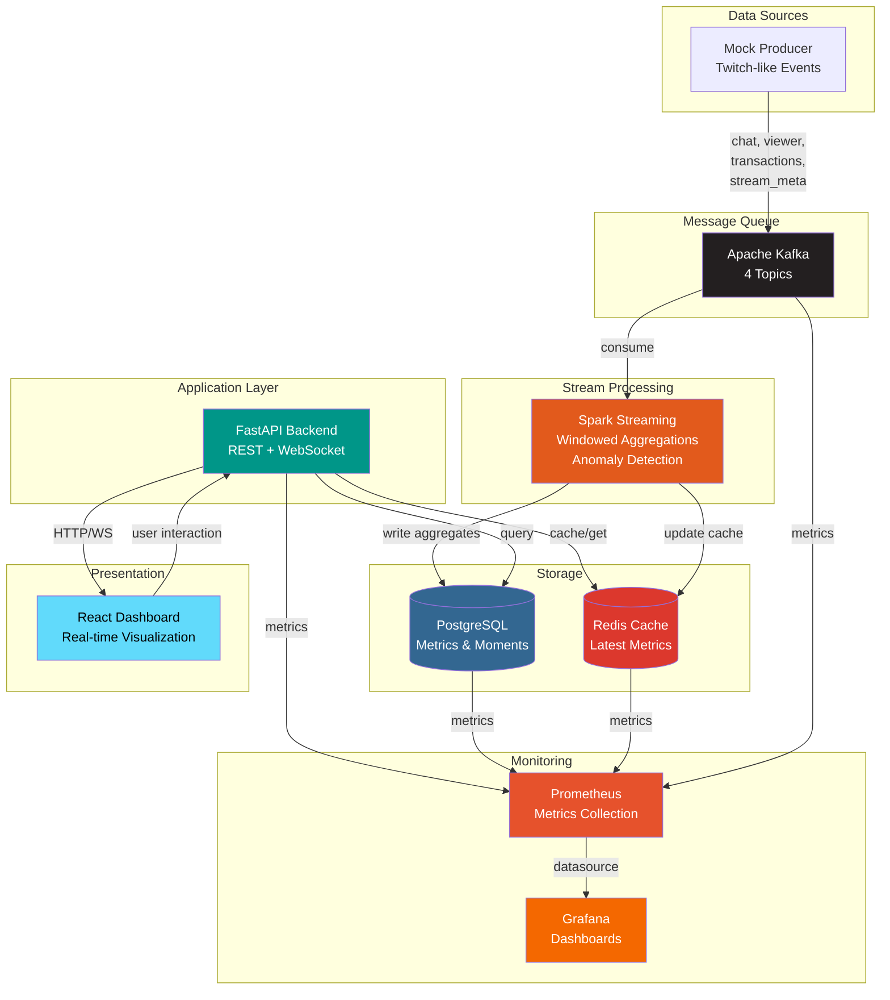

<div align="center">

# 📊 Telemetra

### Real-time Twitch Analytics Platform

_Powered by streaming architecture for instant insights_

<p align="center">
  
  
  
  
  
  
  
</p>

<p align="center">
  
  
  
</p>

<p align="center" style="font-weight: bold;">
  <a href="#-features">Features</a> •
  <a href="#-quick-start">Quick Start</a> •
  <a href="#️-architecture">Architecture</a> •
  <a href="#-documentation">Documentation</a>
</p>

</div>

---

## 📖 Overview

Telemetra processes streaming platform events through a distributed pipeline, providing **real-time analytics**, **sentiment analysis**, and **anomaly detection** for Twitch-like applications. It ingests chat messages, viewer counts, and transactions, then aggregates and visualizes this data through an interactive dashboard.

---

## ✨ Features

<table>
<tr>
<td width="50%">

### ⚙️ Data Pipeline

- ✅ Real-time event ingestion via Kafka
- ✅ 4 topics: chat, viewer, transactions, stream_meta
- ✅ Windowed aggregations (1-min windows)
- ✅ Lexicon-based sentiment analysis
- ✅ Z-score anomaly detection
- ✅ Automatic schema validation

</td>
<td width="50%">

### 📊 Backend API

- ✅ RESTful endpoints (FastAPI)
- ✅ WebSocket streaming at `/ws/live/{stream_id}`
- ✅ Redis caching (sub-ms responses)
- ✅ Structured logging
- ✅ OpenAPI documentation
- ✅ Health checks for all dependencies

</td>
</tr>
<tr>
<td width="50%">

### 🎨 Frontend Dashboard

- ✅ Real-time viewer count with pulse effects
- ✅ Chat rate line charts (Recharts)
- ✅ Emote cloud visualization (D3.js)
- ✅ Moments timeline
- ✅ Responsive design (Tailwind CSS)
- ✅ Auto-reconnect WebSocket

</td>
<td width="50%">

### 🐳 Infrastructure

- ✅ Fully containerized (Docker Compose)
- ✅ 15 services with health checks
- ✅ Resource limits & auto-restart
- ✅ Prometheus + Grafana monitoring
- ✅ CI/CD with GitHub Actions
- ✅ Multiple deployment profiles

</td>
</tr>
</table>

---

## 🚀 Quick Start

### 📋 Prerequisites

<p>


</p>

### ⏱️ 60-Second Setup

```bash
# 1. Clone repository
git clone https://github.com/Stiven-Gjekaj/Telemetra.git
cd Telemetra

# 2. Copy environment configuration
cp .env.example .env

# 3. Start all services (takes 2-3 minutes)
docker compose -f infra/docker-compose.yml --profile dev up --build -d

# 4. Wait for services to become healthy
sleep 120

# 5. Run smoke tests
bash smoke_test.sh

# 6. Open dashboard
open http://localhost:3000
```

### 🌐 Access Points

<table>
<tr>
<th>Service</th>
<th>URL</th>
<th>Purpose</th>
</tr>
<tr>
<td><b>Frontend Dashboard</b></td>
<td><a href="http://localhost:3000">http://localhost:3000</a></td>
<td>Real-time metrics visualization</td>
</tr>
<tr>
<td><b>Backend API</b></td>
<td><a href="http://localhost:8000">http://localhost:8000</a></td>
<td>REST endpoints + WebSocket</td>
</tr>
<tr>
<td><b>API Docs</b></td>
<td><a href="http://localhost:8000/docs">http://localhost:8000/docs</a></td>
<td>Swagger UI</td>
</tr>
<tr>
<td><b>Grafana</b></td>
<td><a href="http://localhost:3001">http://localhost:3001</a></td>
<td>Monitoring dashboards (admin/admin)</td>
</tr>
<tr>
<td><b>Prometheus</b></td>
<td><a href="http://localhost:9090">http://localhost:9090</a></td>
<td>Metrics storage</td>
</tr>
<tr>
<td><b>Spark Master UI</b></td>
<td><a href="http://localhost:8080">http://localhost:8080</a></td>
<td>Cluster management</td>
</tr>
</table>

---

## 🏗️ Architecture



---

## 🛠️ Tech Stack

### Data Processing

<p>


</p>

### Backend

<p>


</p>

### Frontend

<p>


</p>

### Infrastructure

<p>


</p>

---

## 📦 Deployment

### 🐋 Docker Profiles

<table>
<tr>
<th>Profile</th>
<th>Services</th>
<th>Use Case</th>
<th>Resources</th>
</tr>
<tr>
<td><code>dev</code></td>
<td>10 core services + monitoring</td>
<td>Development & Testing</td>
<td>8-10GB RAM</td>
</tr>
<tr>
<td><code>full</code></td>
<td>All 15 services (+ Kafka UI, pgAdmin)</td>
<td>Full-featured development</td>
<td>10-12GB RAM</td>
</tr>
</table>

**Start dev profile:**

```bash
docker compose -f infra/docker-compose.yml --profile dev up -d
```

**Start full profile:**

```bash
docker compose -f infra/docker-compose.yml --profile full --profile dev up -d
```

### 🌐 Service Ports

| Service         | Port | Profile   |
| --------------- | ---- | --------- |
| Frontend        | 3000 | dev, full |
| Backend         | 8000 | dev, full |
| PostgreSQL      | 5432 | dev, full |
| Redis           | 6379 | dev, full |
| Kafka           | 9092 | dev, full |
| Zookeeper       | 2181 | dev, full |
| Spark Master UI | 8080 | dev, full |
| Spark Worker UI | 8081 | dev, full |
| Prometheus      | 9090 | dev, full |
| Grafana         | 3001 | dev, full |
| Kafka UI        | 8888 | full      |
| pgAdmin         | 5050 | full      |

---

## ✅ Validation & Testing

### 🧪 Automated Smoke Tests

```bash
bash smoke_test.sh
```

**Expected output:**

- ✅ Backend health check passes
- ✅ All services running
- ✅ Database connection established
- ✅ Kafka topics created
- ✅ Data flowing through pipeline
- ✅ Frontend accessible

### 🔍 Manual Validation

**Backend health:**

```bash
curl http://localhost:8000/health
# Expected: {"status":"ok"}
```

**Kafka topics:**

```bash
docker compose -f infra/docker-compose.yml exec kafka kafka-topics.sh \
  --list --bootstrap-server localhost:9092
```

**Database data:**

```bash
docker compose -f infra/docker-compose.yml exec postgres psql \
  -U telemetra -d telemetra -c "SELECT COUNT(*) FROM chat_summary_minute;"
```

**WebSocket connection:**

```bash
wscat -c ws://localhost:8000/ws/live/demo_stream
```

### 🧪 Unit Tests

```bash
# Backend tests (35+ test cases)
docker compose -f infra/docker-compose.yml exec backend pytest tests/ -v

# Spark tests (20+ test cases)
cd data_pipeline/spark && pytest test_spark_job.py -v
```

---

## ⚙️ Configuration

### Environment Variables

Edit `.env` to customize:

```bash
# Producer configuration
PRODUCER_RATE_PER_SEC=10        # Messages per second
PRODUCER_CHANNELS=demo_stream   # Comma-separated channel list

# Kafka configuration
KAFKA_LOG_RETENTION_HOURS=168   # 7 days retention

# Database credentials
POSTGRES_USER=telemetra
POSTGRES_PASSWORD=telemetra_dev_password
POSTGRES_DB=telemetra

# Application configuration
LOG_LEVEL=INFO
DEBUG=false
```

---

## ⚙️ Common Tasks

<details>
<summary><b>📝 View Logs</b></summary>

```bash
# All services
docker compose -f infra/docker-compose.yml logs -f

# Specific service
docker compose -f infra/docker-compose.yml logs -f backend
docker compose -f infra/docker-compose.yml logs -f spark-streaming-job
```

</details>

<details>
<summary><b>📊 Monitor Kafka</b></summary>

```bash
# View topics
docker compose -f infra/docker-compose.yml exec kafka kafka-topics.sh \
  --list --bootstrap-server localhost:9092

# Consume messages
docker compose -f infra/docker-compose.yml exec kafka kafka-console-consumer.sh \
  --bootstrap-server localhost:9092 \
  --topic telemetra.events.chat \
  --from-beginning \
  --max-messages 10
```

</details>

<details>
<summary><b>🗄️ Database Access</b></summary>

```bash
# Connect to PostgreSQL
docker compose -f infra/docker-compose.yml exec postgres psql \
  -U telemetra -d telemetra

# Useful queries
SELECT * FROM streams;
SELECT COUNT(*) FROM chat_summary_minute;
SELECT * FROM moments ORDER BY timestamp DESC LIMIT 5;
```

</details>

<details>
<summary><b>💾 Redis Cache</b></summary>

```bash
# Connect to Redis
docker compose -f infra/docker-compose.yml exec redis redis-cli

# Test connection
PING
# Expected: PONG

# View cached keys
KEYS *
```

</details>

---

## 🔧 Troubleshooting

<details>
<summary><b>🚪 Port Already in Use</b></summary>

```bash
# Find what's using the port (Windows)
netstat -ano | findstr :8000

# Find what's using the port (Mac/Linux)
lsof -i :8000

# Kill the process or change port in docker-compose.yml
```

</details>

<details>
<summary><b>🔌 Cannot Connect to Backend</b></summary>

```bash
# Check if service is running
docker compose -f infra/docker-compose.yml ps backend

# View logs
docker compose -f infra/docker-compose.yml logs backend

# Restart
docker compose -f infra/docker-compose.yml restart backend
```

</details>

<details>
<summary><b>📭 No Data in Database</b></summary>

```bash
# Check producer is running
docker compose -f infra/docker-compose.yml logs mock-producer

# Check Kafka has messages
docker compose -f infra/docker-compose.yml exec kafka kafka-topics.sh \
  --list --bootstrap-server localhost:9092

# Check Spark job is processing
docker compose -f infra/docker-compose.yml logs spark-streaming-job
```

</details>

<details>
<summary><b>🔄 Clean Slate Reset</b></summary>

```bash
# Stop all services
docker compose -f infra/docker-compose.yml down -v

# Remove all Telemetra containers
docker ps -a | grep telemetra | awk '{print $1}' | xargs docker rm -f

# Start fresh
docker compose -f infra/docker-compose.yml --profile dev up --build -d
```

</details>

---

## 🗺️ Roadmap

<table>
<tr>
<td width="50%">

### 🎯 Current (MVP - Alpha 0.1.0)

- ✅ Real-time event ingestion and processing
- ✅ Windowed aggregations and anomaly detection
- ✅ REST API and WebSocket streaming
- ✅ Interactive dashboard with visualizations
- ✅ Monitoring with Prometheus + Grafana

</td>
<td width="50%">

### 🚀 Future Enhancements

- 🔜 Integrate with actual Twitch API
- 🔜 ML-based sentiment analysis (BERT, VADER)
- 🔜 Advanced anomaly detection (Isolation Forest, LSTM)
- 🔜 User authentication (JWT, OAuth)
- 🔜 Kubernetes deployment
- 🔜 Multi-region support

</td>
</tr>
</table>

---

## 📚 Documentation

<div align="center">

<table>
<tr>
<td align="center" width="25%">
<h3>🔌 Backend</h3>
<p>FastAPI service<br/>REST API<br/>WebSocket</p>
<a href="./backend/README.md">→ Read More</a>
</td>
<td align="center" width="25%">
<h3>🎨 Frontend</h3>
<p>React dashboard<br/>D3 visualizations<br/>Component architecture</p>
<a href="./frontend/README.md">→ Read More</a>
</td>
<td align="center" width="25%">
<h3>⚡ Data Pipeline</h3>
<p>Kafka topics<br/>Spark streaming<br/>Mock producer</p>
<a href="./data_pipeline/README.md">→ Read More</a>
</td>
<td align="center" width="25%">
<h3>🐳 Infrastructure</h3>
<p>Docker Compose<br/>15 services<br/>Monitoring</p>
<a href="./infra/README.md">→ Read More</a>
</td>
</tr>
</table>

</div>

---

## 📄 License & Support

MIT License — See [LICENSE](LICENSE) for details. If you find this project useful, please consider giving it a star ⭐

---

<div align="center">

**Happy Streaming!** 🚀

</div>
