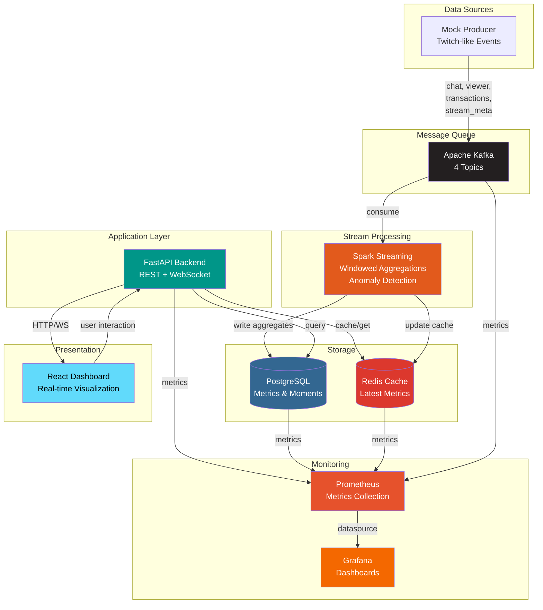

# Telemetra

**Real-time streaming analytics platform for Twitch-like applications**

[](https://github.com/Stiven-Gjekaj/Telemetra/actions)
[](https://opensource.org/licenses/MIT)
[](https://www.docker.com/)
[](https://www.python.org/)
[](https://reactjs.org/)

---

## Table of Contents

- [Overview](#overview)
- [Features](#features)
- [Quickstart](#quickstart)
- [Architecture](#architecture)
- [Subproject Links](#subproject-links)
- [Tech Stack](#tech-stack)
- [Deployment](#deployment)
- [Testing](#testing)
- [Roadmap](#roadmap)
- [License](#license)
- [📂 Documentation Map](#-documentation-map)

---

## Overview

Telemetra processes streaming platform events through a distributed pipeline, providing real-time analytics, sentiment analysis, and anomaly detection for Twitch-like applications. It ingests chat messages, viewer counts, and transactions, then aggregates and visualizes this data through an interactive dashboard.

The platform demonstrates modern data engineering practices with [Apache Kafka](https://kafka.apache.org/) for event streaming, [Apache Spark](https://spark.apache.org/) for real-time processing, [PostgreSQL](https://www.postgresql.org/) for storage, [Redis](https://redis.io/) for caching, [FastAPI](https://fastapi.tiangolo.com/) for the API layer, and [React](https://reactjs.org/) for visualization.

---

## Features

⚙️ **Data Pipeline**
- Real-time event ingestion via Kafka (4 topics: chat, viewer, transactions, stream_meta)
- Windowed aggregations with 1-minute tumbling windows and 10-second slides
- Lexicon-based sentiment analysis on chat messages
- Z-score anomaly detection for viral moments and unusual activity
- Automatic schema validation with JSON schemas

📊 **Backend API**
- RESTful endpoints: `/health`, `/streams`, `/streams/{id}/metrics`, `/streams/{id}/moments`
- WebSocket streaming at `/ws/live/{stream_id}` for real-time updates
- Redis caching layer for sub-millisecond response times
- Structured logging with correlation IDs
- OpenAPI documentation (Swagger UI)

🔗 **Frontend Dashboard**
- Real-time viewer count with animated pulse effects
- Chat rate line charts with [Recharts](https://recharts.org/)
- Emote cloud visualization with [D3.js](https://d3js.org/)
- Moments timeline showing detected anomalies
- Responsive design with [Tailwind CSS](https://tailwindcss.com/)

🧩 **Infrastructure**
- Fully containerized with [Docker Compose](https://docs.docker.com/compose/)
- 15 services with health checks and resource limits
- Automatic database schema initialization
- [Prometheus](https://prometheus.io/) + [Grafana](https://grafana.com/) monitoring stack
- CI/CD with [GitHub Actions](https://github.com/features/actions)

---

## Quickstart

```bash
# Clone repository
git clone https://github.com/Stiven-Gjekaj/Telemetra.git
cd Telemetra

# Copy environment configuration
cp .env.example .env

# Start all services (takes 2-3 minutes)
docker compose -f infra/docker-compose.yml --profile dev up --build -d

# Verify services
docker compose -f infra/docker-compose.yml ps

# Run smoke tests
bash smoke_test.sh

# Access dashboard
open http://localhost:3000

# Access API docs
open http://localhost:8000/docs

# Access Grafana monitoring
open http://localhost:3001  # Login: admin/admin
```

---

## Architecture



---

## Subproject Links

🔗 **Component Documentation**

- **[Backend](./backend/README.md)** — FastAPI service, REST API, WebSocket, PostgreSQL/Redis integration
- **[Frontend](./frontend/README.md)** — React dashboard, D3 visualizations, real-time charts
- **[Data Pipeline](./data_pipeline/README.md)** — Kafka producer, Spark streaming, event processing
- **[Infrastructure](./infra/README.md)** — Docker Compose, services configuration, deployment

---

## Tech Stack

**Data Processing**
- [Apache Kafka](https://kafka.apache.org/) 7.5.0 — Event streaming platform
- [Apache Spark](https://spark.apache.org/) 3.5.0 — Distributed stream processing
- [PySpark](https://spark.apache.org/docs/latest/api/python/) — Python API for Spark

**Backend**
- [FastAPI](https://fastapi.tiangolo.com/) 0.109.0 — Modern async web framework
- [PostgreSQL](https://www.postgresql.org/) 15 — Relational database
- [Redis](https://redis.io/) 7 — In-memory cache
- [asyncpg](https://github.com/MagicStack/asyncpg) — Async PostgreSQL driver
- [structlog](https://www.structlog.org/) — Structured logging

**Frontend**
- [React](https://reactjs.org/) 18.2 — UI library
- [TypeScript](https://www.typescriptlang.org/) 5.3 — Type-safe JavaScript
- [Vite](https://vitejs.dev/) 5.0 — Build tool
- [Tailwind CSS](https://tailwindcss.com/) 3.4 — Utility-first CSS
- [Recharts](https://recharts.org/) 2.10 — Chart library
- [D3.js](https://d3js.org/) 7.8 — Data visualization

**Infrastructure**
- [Docker](https://www.docker.com/) — Containerization
- [Docker Compose](https://docs.docker.com/compose/) — Multi-container orchestration
- [Prometheus](https://prometheus.io/) — Metrics collection
- [Grafana](https://grafana.com/) — Metrics visualization
- [Nginx](https://nginx.org/) — Web server

---

## Deployment

The platform runs entirely with Docker Compose. See **[infra/README.md](./infra/README.md)** for detailed deployment instructions.

**Quick Deploy:**

```bash
cp .env.example .env
docker compose -f infra/docker-compose.yml --profile dev up -d
```

**Services & Ports:**

| Service | Port | Purpose |
|---------|------|---------|
| Frontend | 3000 | React dashboard |
| Backend | 8000 | REST API + WebSocket |
| PostgreSQL | 5432 | Database |
| Redis | 6379 | Cache |
| Kafka | 9092 | Message broker |
| Spark Master UI | 8080 | Cluster status |
| Grafana | 3001 | Monitoring dashboards |
| Prometheus | 9090 | Metrics storage |

**Profiles:**
- `dev` — Core 10 services (excludes Kafka UI, pgAdmin)
- `full` — All 15 services including management UIs

---

## Testing

The project includes comprehensive test coverage with unit, integration, and end-to-end tests.

**Run All Tests:**

```bash
# Backend tests (35+ test cases)
docker compose -f infra/docker-compose.yml exec backend pytest tests/ -v

# Spark tests (20+ test cases)
cd data_pipeline/spark && pytest test_spark_job.py -v

# Smoke tests (integration)
bash smoke_test.sh

# CI/CD (automated)
git push origin main  # Triggers GitHub Actions
```

**Test Coverage:**
- Backend: API endpoints, WebSocket, database queries, Redis caching
- Spark: Aggregations, windowing, sentiment analysis, anomaly detection
- Integration: End-to-end data flow validation

See **[SMOKE_TESTS.md](./SMOKE_TESTS.md)** for validation procedures.

---

## Roadmap

**Current (MVP)**
- ✅ Real-time event ingestion and processing
- ✅ Windowed aggregations and anomaly detection
- ✅ REST API and WebSocket streaming
- ✅ Interactive dashboard with visualizations
- ✅ Monitoring with Prometheus + Grafana

**Future Enhancements**
- Integrate with actual Twitch API (replace mock producer)
- ML-based sentiment analysis (BERT, VADER)
- Advanced anomaly detection (Isolation Forest, LSTM)
- User authentication and authorization (JWT, OAuth)
- Horizontal scaling with Kubernetes
- Multi-region deployment support

---

## License

MIT License — See [LICENSE](LICENSE) for details.

---

## Credits

Built with modern data engineering best practices. Designed for educational and production use cases.

- **Repository:** [github.com/Stiven-Gjekaj/Telemetra](https://github.com/Stiven-Gjekaj/Telemetra)
- **Issues:** [github.com/Stiven-Gjekaj/Telemetra/issues](https://github.com/Stiven-Gjekaj/Telemetra/issues)

---

## 📂 Documentation Map

```
├── backend → ./backend/README.md
├── frontend → ./frontend/README.md
├── data_pipeline → ./data_pipeline/README.md
├── infra → ./infra/README.md
├── QUICKSTART.md — 5-minute setup guide
├── DEPLOYMENT_CHECKLIST.md — Step-by-step deployment
├── SMOKE_TESTS.md — Testing and validation
└── TELEMETRA_MVP_DELIVERY.md — Complete delivery summary
```

---

**Happy Streaming!** 🚀 Open [http://localhost:3000](http://localhost:3000) to see real-time analytics in action.
